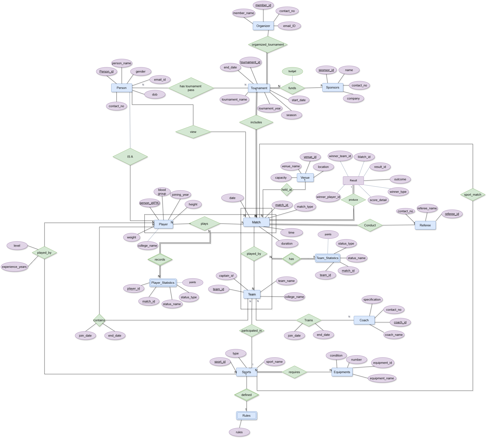

<div align="center">

# Sports Tournament Management System

### A PostgreSQL database for sports fests

*Built for events like Concours (DA-IICT) · Udghosh (IIT Kanpur) · Riviera (VIT) · Shaurya (IIT KGP)*


</div>

---

## The Problem

College sports fests run on paper forms, WhatsApp groups, and Excel sheets.

- A player fills the same registration form every year from scratch
- Venue double-bookings are discovered the morning of the match
- No one knows in real-time who is winning what across venues
- Historical records — player career stats, past tournament winners — don't exist
- A referee's result on paper takes hours to become a published scoreline

**This system replaces all of that** with a single centralized PostgreSQL database — one source of truth for every player, team, match, result, venue, sponsor, and statistic.

---

## ER Diagram



> Full design rationale → [`design_decisions.md`](design_decisions.md)

---

## What's Inside

### Database Layer

| File | Contents |
|---|---|
| [`schema/01_tables.sql`](schema/01_tables.sql) | 27 tables — all entities, junction tables, constraints |
| [`schema/02_indexes.sql`](schema/02_indexes.sql) | 49 secondary indexes with documented reasoning |
| [`schema/03_trigger.sql`](schema/03_trigger.sql) | 13 triggers enforcing business rules |
| [`schema/04_views.sql`](schema/04_views.sql) | 8 views — player profiles, leaderboard, schedule, sponsors |
| [`schema/05_procedures.sql`](schema/05_procedures.sql) | 5 stored procedures for core operations |

### Data Layer

| File | Contents |
|---|---|
| [`seed/01_coreentity.sql`](seed/01_coreentity.sql) | 30 persons, 8 sports, 6 tournaments, 8 venues, 10 coaches, 8 referees |
| [`seed/02_dependent_entities.sql`](seed/02_dependent_entities.sql) | 25 players, 12 teams, 24 matches with full schedule |
| [`seed/03_relation_entity.sql`](seed/03_relation_entity.sql) | All junction tables — rosters, stats, results, passes |

### Query Library

| File | Contents |
|---|---|
| [`queries/01_queries.sql`](queries/01_queries.sql) | 15 analytical queries across Easy / Intermediate / Advanced categories |

---

## Schema Overview

**Strong Entities** — independent objects with their own identity

| Entity | Purpose |
|---|---|
| `Person` | Every human in the system — base identity, ISA superclass |
| `Player` | ISA subclass of Person — adds height, weight, blood group, joining year |
| `Tournament` | One edition of a sports fest — name, year, season, dates |
| `Sports` | A sport discipline — cricket, football, badminton, etc. |
| `Team` | A college team registered to play a specific sport |
| `Match` | A scheduled game — sport, tournament, venue, referee, date, time |
| `Result` | Outcome of a completed match — winner, score, outcome |
| `Venue` | Physical location with name, location, capacity |
| `Referee` | Match official assigned to conduct games |
| `Coach` | Team trainer with specialisation and history |
| `Organizer` | Committee member running the tournament |
| `Sponsors` | Funding organizations linked to tournaments |
| `Equipments` | Physical inventory tracked by name, quantity, and condition |

**Junction Tables** — relationships with their own attributes

| Table | Relationship | Key Attributes |
|---|---|---|
| `PlayerTeam` | Player ↔ Team | `join_date`, `end_date` (full history) |
| `TeamCoach` | Coach ↔ Team | `join_date`, `end_date` (full history) |
| `PlayerSport` | Player ↔ Sport | `level`, `experience_years` |
| `TeamPlaysMatch` | Team ↔ Match | `score` |
| `PlayerPlaysMatch` | Player ↔ Match | — |
| `SponsorsTournament` | Sponsor ↔ Tournament | `budget` |
| `PersonPass` | Person ↔ Tournament | `pass_type`, `pass_number` |
| `PersonViewMatch` | Person ↔ Match | `seat_number` |
| `OrganizeTournament` | Organizer ↔ Tournament | `role`, `department` |

**Weak Entities** — identified only through their owner

| Entity | Owner | Partial Key |
|---|---|---|
| `Rules` | Sports | `rule_no` (restarts per sport) |
| `PlayerStatistics` | Player + Match | `status_name` |
| `TeamStatistics` | Team + Match | `status_name` |

---

## Key Design Decisions

### 1 Overlapping ISA Hierarchy
`Person` is the superclass. `Player` and `Spectator` are subclasses marked **overlapping** — a cricket player can watch a football match without any special registration. The `PersonViewMatch` relationship connects to `Person`, not `Spectator`, because viewing is a behaviour any person can exhibit — not a role-specific action.

### 2 Sport-Agnostic Statistics Model
Every stat is stored as a named row `(status_name, status_value)` — not as hardcoded columns. Goals, wickets, rebounds, KDA ratio — any statistic for any sport fits the same schema. **Adding a new sport requires zero DDL changes.**

### 3 Temporal Relationship Tracking
`PlayerTeam` and `TeamCoach` carry `join_date` and `end_date`. The database answers historical questions: *"Who was on the cricket team in the 2022 tournament?"* — not just current membership but the full career history. `end_date IS NULL` means currently active.

### 4 Result Supports Both Sport Types
`Result.winner_type` discriminates between `'team'` and `'individual'` sports with a cross-column CHECK constraint — you cannot record a team winner for a badminton singles final. The constraint `chk_winner_consistency` enforces mutual exclusivity at the database level.

### 5 Deliberate CASCADE Rules Per FK
Every FK has an intentional `ON DELETE` action based on one question: *does the child row have meaning without the parent?*
- Deleting a `Tournament` → **CASCADE** to matches, passes, results (all meaningless without the tournament)
- Deleting a `Referee` → **SET NULL** on `Match.referee_id` (the match still happened)
- Deleting a `Player` who is captain → **SET NULL** on `Team.captain_id` (team survives, position becomes vacant)

---

## Triggers — Business Rules Enforced by the Database

| Trigger | Rule Enforced |
|---|---|
| `trg_captain_must_be_team_member` | A player must be on the team before they can be named captain |
| `trg_player_sport_match` | A player can only play in a match for a sport they are registered in |
| `trg_team_sport_match` | A team can only play in a match that matches the team's sport |
| `trg_venue_conflict` | No two matches at the same venue on the same date and time |
| `trg_referee_conflict` | A referee cannot officiate two matches at the same time |
| `trg_tournament_year` | Tournament year must match the year of the start date |
| `trg_match_date_in_tournament` | Match date must fall within the tournament's start and end dates |
| `trg_player_joining_year` | A player's joining year cannot be before their birth year |
| `trg_playerteam_joindate` | PlayerTeam join date cannot be before the player's joining year |
| `trg_one_result_per_match` | Only one result is allowed per match |
| `trg_result_winner_played` | The winning team or player must have actually played in that match |
| `trg_default_registration_date` | Auto-sets `registration_date` to today if not provided |
| `trg_pass_tournament_active` | Cannot register a pass for a tournament that has already ended |

---

## Views

| View | What It Shows |
|---|---|
| `vw_player_profile` | Full player info — Person + Player joined with all attributes |
| `vw_tournament_overview` | Tournament with total matches, sponsors, and total sponsorship budget |
| `vw_match_results` | Every result with match info, sport, tournament, and winner name resolved |
| `vw_team_info` | Team with sport name, captain name, and total player count |
| `vw_player_team_history` | Full team membership history per player with active/inactive status |
| `vw_active_coaches` | Current coaching assignments with team, sport, and coach details |
| `vw_tournament_sponsors` | Sponsors per tournament sorted by budget contribution |
| `vw_upcoming_matches` | All future matches with venue, referee, and tournament details |

---

## Stored Procedures

| Procedure | What It Does |
|---|---|
| `sp_register_tournament_pass` | Registers a person's pass — validates tournament is still active before inserting |
| `sp_record_result` | Records a match result — validates the winner actually played in the match |
| `sp_remove_player_from_team` | Sets `end_date` on PlayerTeam (preserves history) — clears captaincy if applicable |
| `sp_assign_coach_to_team` | Assigns a coach to a team — validates no active duplicate assignment exists |
| `sp_add_player_statistic` | Adds a stat row — validates the player played in the match and stat type is consistent |

---


## Quick Start

```bash
# 1. Clone the repository
git clone https://github.com/<your-username>/sports-tournament-db.git
cd sports-tournament-db

# 2. Create the database
psql -U postgres -c "CREATE DATABASE SportTournamentDB;"

# 3. Run schema in order
psql -U postgres -d SportTournamentDB -f schema/01_tables.sql
psql -U postgres -d SportTournamentDB -f schema/02_indexes.sql
psql -U postgres -d SportTournamentDB -f schema/03_trigger.sql
psql -U postgres -d SportTournamentDB -f schema/04_views.sql
psql -U postgres -d SportTournamentDB -f schema/05_procedures.sql

# 4. Load seed data in order
psql -U postgres -d SportTournamentDB -f seed/01_coreentity.sql
psql -U postgres -d SportTournamentDB -f seed/02_dependent_entities.sql
psql -U postgres -d SportTournamentDB -f seed/03_relation_entity.sql

# 5. Run sample queries
psql -U postgres -d SportTournamentDB -f queries/01_queries.sql
```

---


## Tech Stack

| Tool | Purpose |
|---|---|
| PostgreSQL 16 | Primary database engine |
| pgAdmin 4 | Schema design and query execution |
| draw.io | ER diagram |

---

<div align="center">


<sub>Designed as part of the DBMS course at DA-IICT · 2025–26</sub>

</div>
